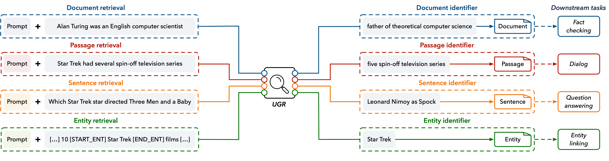

# UGR

This is the source code for paper "[A Unified Generative Retriever for Knowledge-Intensive Language Tasks via Prompt Learning](https://dl.acm.org/doi/10.1145/3539618.3591631)".

## Introduction



Knowledge-intensive language tasks (KILTs) benefit from retrieving high-quality relevant contexts from large external knowledge corpora. Learning task-specific retrievers that return relevant contexts at an appropriate level of semantic granularity, such as a document retriever, passage retriever, sentence retriever, and entity retriever, may help to achieve better performance on the end-to-end task. But a task-specific retriever usually has poor generalization ability to new domains and tasks, and it may be costly to deploy a variety of specialized retrievers in practice.

We propose a unified generative retriever (**UGR**) that combines task-specific effectiveness with robust performance over different retrieval tasks in KILTs. To achieve this goal, we make two major contributions:
- To unify different retrieval tasks into a single generative form, we introduce an n-gram-based identifier for relevant contexts at different levels of granularity in KILTs.
- To address different retrieval tasks with a single model, we employ a prompt learning strategy and investigate three methods to design prompt tokens for each task.

In this way, the proposed UGR model can not only share common knowledge across tasks for better generalization but also perform different retrieval tasks effectively by distinguishing task-specific characteristics. We train UGR on a heterogeneous set of retrieval corpora with well-designed prompts in a supervised and multi-task fashion. Experimental results on the KILT benchmark demonstrate the effectiveness of UGR on in-domain datasets, out-of-domain datasets, and unseen tasks.


## Acknowledgement

- [fairseq](https://github.com/facebookresearch/fairseq)
- [GENRE](https://github.com/facebookresearch/GENRE)
- [KILT](https://github.com/facebookresearch/KILT)

## License

This project is under Apache License 2.0.

## Citation

If you find our work useful, please consider citing our paper:
```
@inproceedings{chen2023a,
	author = {Chen, Jiangui and Zhang, Ruqing and Guo, Jiafeng and Rijke, Maarten de and Liu, Yiqun and Fan, Yixing and Cheng, Xueqi},
	booktitle = {Proceedings of the 46th {International} {ACM} {SIGIR} {Conference} on {Research} and {Development} in {Information} {Retrieval}},
	year = {2023},
	pages = {1448--1457},
	organization = {ACM},
	title = {A {Unified} {Generative} {Retriever} for {Knowledge}-{Intensive} {Language} {Tasks} via {Prompt} {Learning}},
	volume = {},
}
```
